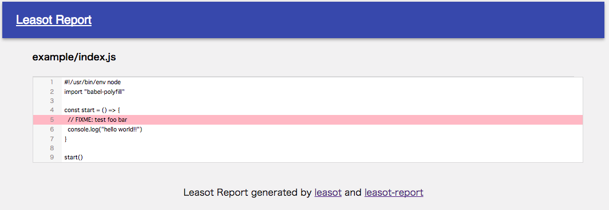

# leasot-report

[](https://badge.fury.io/js/leasot-report)

leasot-report is a command line tool that uses [leasot](https://github.com/pgilad/leasot) to output TODOs and FIXMEs in your code




### Usage


```sh
npm i -g leasot-report

 or

npm i --save-dev leasot-report
```

Run the output reports
```sh
$ leasot-report src

$ ls leasot-reports/
 example		index.html

```


### Supported extensions
".js", ".jsx", ".css", ".sass", ".java", ".go", ".php", ".rb"

### Demos

[storybook](https://wheatandcat.github.io/leasot-report/)
