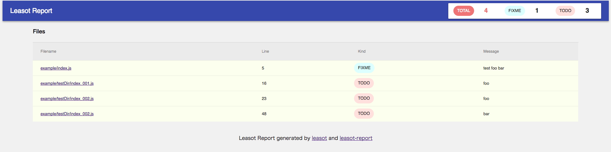

# leasot-report

[](https://badge.fury.io/js/leasot-report)

leasot-report is a command line tool that uses leasot to output TODOs and FIXMEs in your code




## Usage


```sh
npm i -g leasot-report

 or

npm i --save-dev leasot-report
```

Run the output reports
```sh
leasot-report src
```
